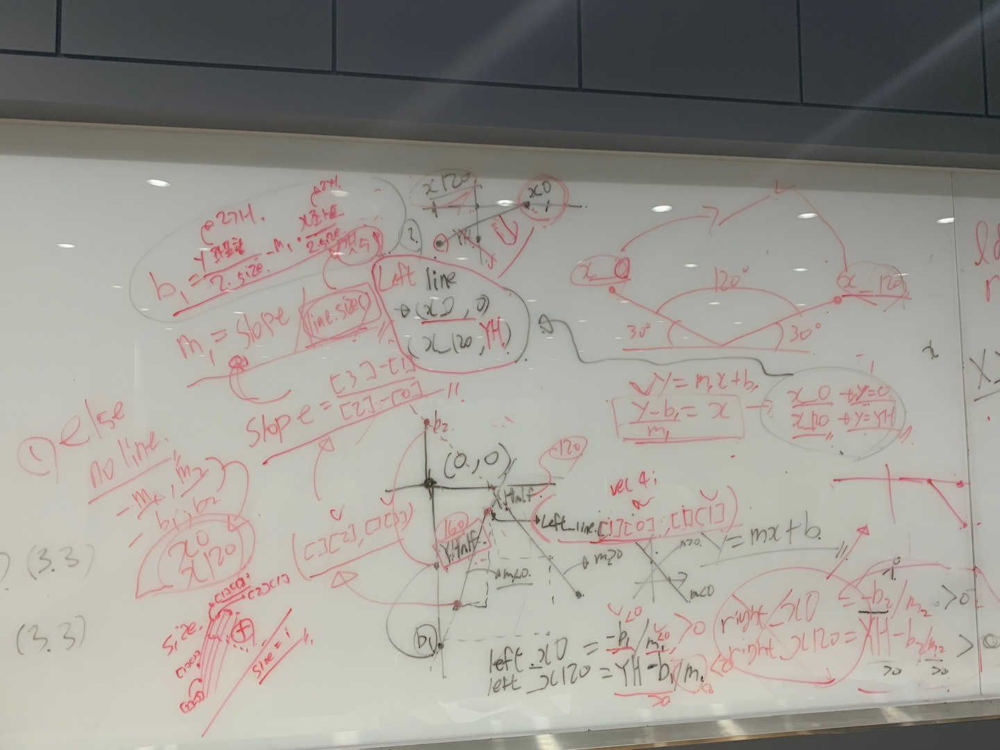
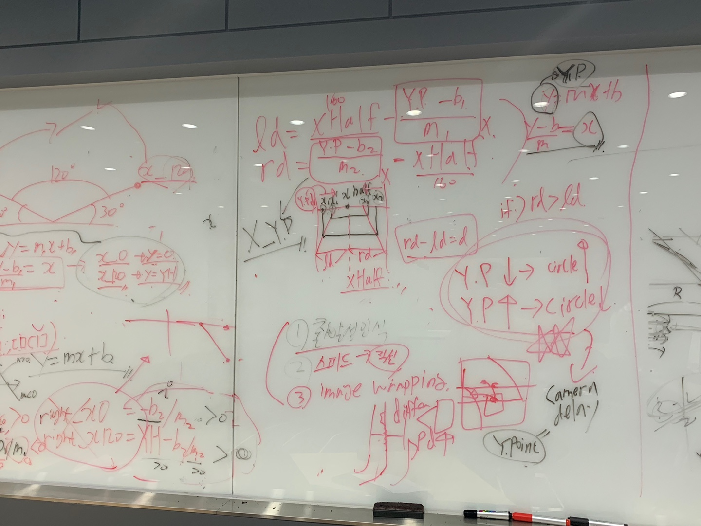

# smartCarCamp

Automatic car competition was held in 2019 at HGU.

In this competition, we used ROS technique and I don't understand all of tech, but I knew all process to activate car. ( node to node communication)

Furthermore, my team used openCV to detect line and PID control to make the car smooth driving.

We arranged speed on the course (curve, straight line).

Especially, In camera_on code, left and right lines are detected resulting in average values at each line.

In mailbox_node code, PID control and speed arrangement are used.

To understand ROS technique fully, I have to know about network, but I didn't know about that ; msg communication.

And my team analyzed line detection algorithm with Mathematics like these pictures.

To communicate with Rasberry PI in automatic car, we used Ubuntu for linux build.

In this sequence, we build files to activate car.
1. roscore
2. rosrun camera_show camera_show_node
3. sudo chmod 666 /dev/ttyACMO
4. rosrun rosserial_python serial_node.py /dev/ttyACMO
5. rosrun mailbox mailbox_node

we failed to stop the car at the stop line because we didn't build code to send msg 'stop' to car.

our team spent about a month and got 3rd prize.
